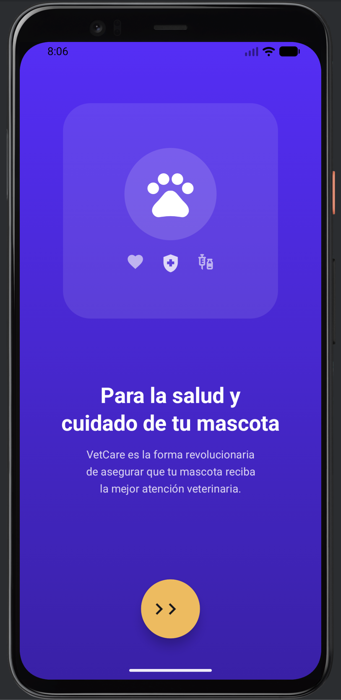
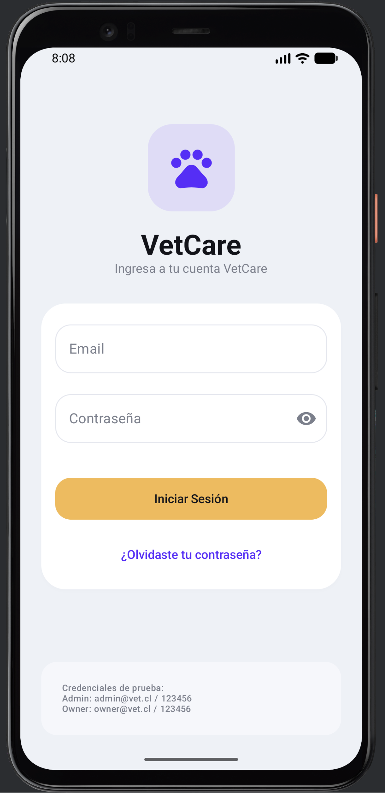
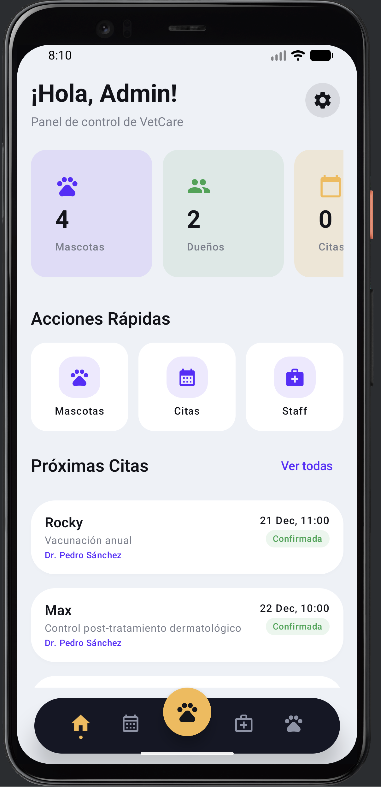
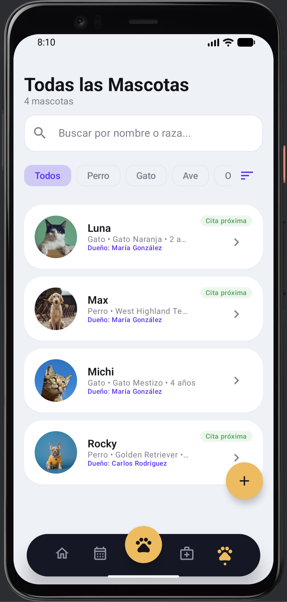
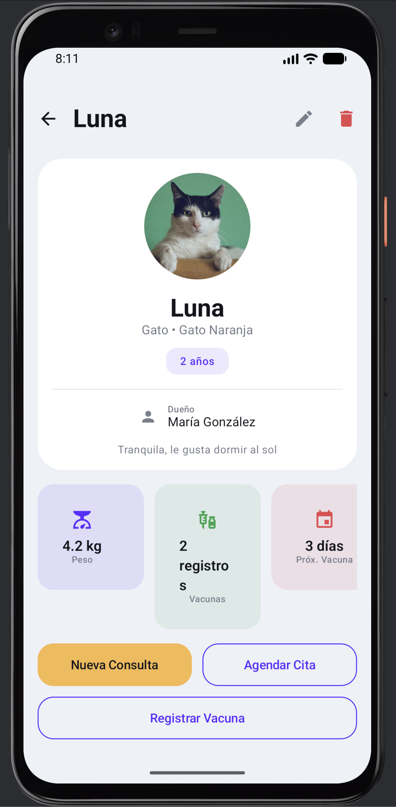
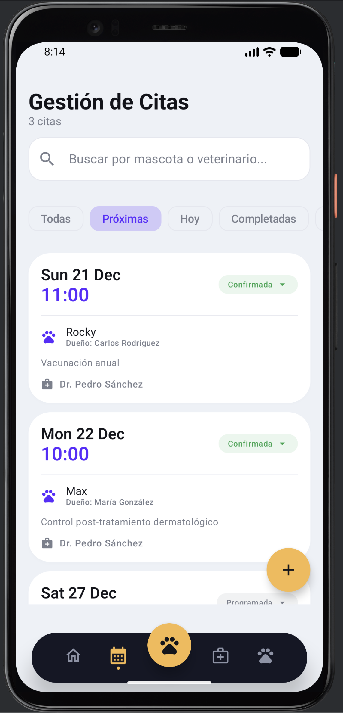
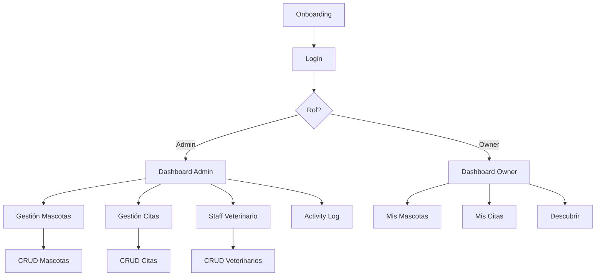

<picture>
  <source media="(prefers-color-scheme: dark)" srcset="https://capsule-render.vercel.app/api?type=waving&color=gradient&customColorList=12,14,16,18,20&height=180&section=header&text=VetCare&fontSize=80&fontColor=ffffff&animation=fadeIn&fontAlignY=35&desc=Sistema%20de%20Gestión%20Veterinaria&descSize=20&descAlignY=55">
  <source media="(prefers-color-scheme: light)" srcset="https://capsule-render.vercel.app/api?type=waving&color=gradient&customColorList=12,14,16,18,20&height=180&section=header&text=VetCare&fontSize=80&fontColor=ffffff&animation=fadeIn&fontAlignY=35&desc=Sistema%20de%20Gestión%20Veterinaria&descSize=20&descAlignY=55">
  
</picture>

<div align="center">

[](https://kotlinlang.org/)
[](https://developer.android.com/jetpack/compose)
[](https://developer.android.com/training/data-storage/room)
[](https://m3.material.io/)
[](https://developer.android.com/)
[](https://developer.android.com/topic/architecture)
[](LICENSE)

**Aplicación Android nativa para la gestión integral de clínicas veterinarias**

[Características](#-características) • [Arquitectura](#-arquitectura) • [Instalación](#-instalación) • [Demo](#-demo) • [Documentación](#-documentación)

</div>

---

## 📋 Tabla de Contenidos

- [Descripción General](#-descripción-general)
- [Características](#-características)
- [Stack Tecnológico](#-stack-tecnológico)
- [Arquitectura](#-arquitectura)
- [Estructura del Proyecto](#-estructura-del-proyecto)
- [Instalación](#-instalación)
- [Configuración](#-configuración)
- [Demo](#-demo)
- [Módulos del Sistema](#-módulos-del-sistema)
- [Accesibilidad y Temas](#-accesibilidad)
- [Flujo de Usuario](#-flujo-de-usuario)
- [Roadmap](#-roadmap)
- [Autor](#-autor)

---

## 🎯 Descripción General

**VetCare** es una solución móvil completa diseñada para digitalizar y optimizar las operaciones diarias de clínicas veterinarias. La aplicación permite gestionar pacientes (mascotas), registrar consultas médicas, administrar la agenda de veterinarios y automatizar recordatorios de citas y vacunas para los propietarios de mascotas.

### Problema que Resuelve

| Desafío | Solución VetCare |
|---------|------------------|
| Gestión manual de expedientes | Sistema digital centralizado de mascotas |
| Agendamiento desorganizado | Calendario integrado con filtros avanzados |
| Falta de seguimiento médico | Historial completo de consultas y tratamientos |
| Olvido de citas/vacunas | Notificaciones automáticas programadas |
| Acceso limitado para dueños | Portal dedicado para propietarios |

---

## ✨ Características

<div align="center">

| Módulo | Funcionalidades |
|--------|-----------------|
| 🔐 **Autenticación** | Login seguro, recuperación de contraseña, roles diferenciados |
| 🐾 **Gestión de Mascotas** | CRUD completo, historial médico, registro de vacunas |
| 📅 **Agenda de Citas** | Programación, filtros por estado, asignación de veterinarios |
| 👨‍⚕️ **Staff Veterinario** | Directorio, especialidades, agenda por profesional |
| 🔔 **Notificaciones** | Recordatorios automáticos de citas y vacunas |
| 📊 **Dashboard Admin** | Métricas en tiempo real, accesos rápidos |
| 💾 **Persistencia Local** | Room Database (SQLite), datos offline, sincronización automática |
| 📝 **Registro de Actividad** | Auditoría completa de acciones del sistema |
| 🎨 **Temas y Apariencia** | Modo Claro, Oscuro y Automático (según sistema) |
| ♿ **Accesibilidad** | Alto contraste, reducción de animaciones, TalkBack |
| 🎯 **UI/UX Premium** | Material 3, animaciones fluidas, diseño adaptativo |

</div>

### Características Técnicas Destacadas

```
✅ Arquitectura MVVM con StateFlow reactivo
✅ Persistencia local con Room Database (SQLite)
✅ Operaciones CRUD completas sin conexión a internet
✅ TypeConverters para LocalDateTime y Enums
✅ Navegación declarativa con Compose Navigation
✅ Notificaciones con WorkManager
✅ Animaciones con AnimatedVisibility y animateContentSize
✅ Sistema de temas dinámico (Claro/Oscuro/Sistema)
✅ Soporte de accesibilidad (TalkBack, alto contraste)
✅ Componentes UI reutilizables
✅ Validación de formularios en tiempo real
✅ Manejo centralizado de errores
✅ Sistema de logging para auditoría
✅ Búsqueda con debounce optimizado (300ms)
✅ Localización completa en Español (ES-CL)
```

---

## 🛠 Stack Tecnológico

<div align="center">

### Core
| Tecnología | Versión | Propósito |
|------------|---------|-----------|
|  | 2.0.21 | Lenguaje principal |
|  | BOM 2024.09 | UI declarativa |
|  | Latest | Sistema de diseño |

### Persistencia de Datos
| Tecnología | Versión | Propósito |
|------------|---------|-----------|
|  | 2.6.1 | Base de datos SQLite |
| SharedPreferences | - | Configuración de usuario |
| KSP | 2.0.21-1.0.25 | Procesador de anotaciones |

### Arquitectura & Datos
| Tecnología | Propósito |
|------------|-----------|
| MVVM | Patrón de arquitectura |
| StateFlow | Gestión de estado reactivo |
| ViewModel | Persistencia de UI state |
| Repository Pattern | Abstracción de datos |

### Funcionalidades
| Tecnología | Propósito |
|------------|-----------|
| Navigation Compose | Navegación entre pantallas |
| WorkManager | Programación de notificaciones |
| Coroutines | Operaciones asíncronas |

</div>

---

## 🏗 Arquitectura

El proyecto implementa **Clean Architecture** con el patrón **MVVM** (Model-View-ViewModel), garantizando separación de responsabilidades, testabilidad y mantenibilidad.

```
┌─────────────────────────────────────────────────────────────────┐
│                        PRESENTATION LAYER                        │
│  ┌─────────────────┐    ┌─────────────────┐    ┌──────────────┐ │
│  │    Screens      │◄───│   ViewModels    │◄───│   UiState    │ │
│  │   (Compose)     │    │  (StateFlow)    │    │ (Data Class) │ │
│  └─────────────────┘    └─────────────────┘    └──────────────┘ │
├─────────────────────────────────────────────────────────────────┤
│                         DOMAIN LAYER                             │
│  ┌─────────────────┐    ┌─────────────────┐                     │
│  │     Models      │    │   Use Cases     │                     │
│  │  (Data Class)   │    │   (Business)    │                     │
│  └─────────────────┘    └─────────────────┘                     │
├─────────────────────────────────────────────────────────────────┤
│                          DATA LAYER                              │
│  ┌─────────────────┐    ┌─────────────────┐    ┌──────────────┐ │
│  │   Repository    │◄───│      DAOs       │◄───│   Entities   │ │
│  │   (Singleton)   │    │  (Room/SQLite)  │    │   (@Entity)  │ │
│  └─────────────────┘    └─────────────────┘    └──────────────┘ │
│                               │                                  │
│                    ┌──────────▼──────────┐                      │
│                    │   Room Database     │                      │
│                    │  (vetcare_database) │                      │
│                    └─────────────────────┘                      │
└─────────────────────────────────────────────────────────────────┘
```

### Flujo de Datos

```
User Action → Screen → ViewModel → Repository → DAO → Room Database (SQLite)
                ↑                                              │
                └──────────── StateFlow/Flow ◄────────────────┘
```

### Persistencia Local

La aplicación utiliza **Room Database** como capa de abstracción sobre SQLite, proporcionando:

- **Operaciones offline**: Todos los datos persisten localmente sin necesidad de conexión
- **Type Safety**: Verificación en tiempo de compilación de consultas SQL
- **Reactive Streams**: Integración nativa con Kotlin Coroutines y Flow
- **Migrations**: Soporte para actualizaciones de esquema de base de datos

---

## 📁 Estructura del Proyecto

```
app/
├── src/main/
│   ├── java/com/example/vetcare/
│   │   ├── VetCareApplication.kt            # Application class (inicializa Room)
│   │   │
│   │   ├── data/
│   │   │   ├── local/
│   │   │   │   ├── VetCareDatabase.kt       # Room Database principal
│   │   │   │   ├── Converters.kt            # TypeConverters (DateTime, Enums)
│   │   │   │   │
│   │   │   │   ├── dao/                     # Data Access Objects
│   │   │   │   │   ├── UserDao.kt
│   │   │   │   │   ├── OwnerDao.kt
│   │   │   │   │   ├── PetDao.kt
│   │   │   │   │   ├── VeterinarianDao.kt
│   │   │   │   │   ├── AppointmentDao.kt
│   │   │   │   │   ├── ConsultationDao.kt
│   │   │   │   │   ├── VaccineRecordDao.kt
│   │   │   │   │   └── ActivityEventDao.kt
│   │   │   │   │
│   │   │   │   ├── entity/                  # Room Entities (@Entity)
│   │   │   │   │   ├── UserEntity.kt
│   │   │   │   │   ├── OwnerEntity.kt
│   │   │   │   │   ├── PetEntity.kt
│   │   │   │   │   ├── VeterinarianEntity.kt
│   │   │   │   │   ├── AppointmentEntity.kt
│   │   │   │   │   ├── ConsultationEntity.kt
│   │   │   │   │   ├── VaccineRecordEntity.kt
│   │   │   │   │   └── ActivityEventEntity.kt
│   │   │   │   │
│   │   │   │   └── mapper/
│   │   │   │       └── EntityMappers.kt     # Conversión Entity ↔ Model
│   │   │   │
│   │   │   ├── logging/
│   │   │   │   └── ActivityLogger.kt        # Sistema de auditoría
│   │   │   │
│   │   │   ├── model/                       # Modelos de dominio
│   │   │   │   ├── User.kt
│   │   │   │   ├── Owner.kt
│   │   │   │   ├── Pet.kt
│   │   │   │   ├── Appointment.kt
│   │   │   │   ├── Veterinarian.kt
│   │   │   │   ├── Consultation.kt
│   │   │   │   ├── VaccineRecord.kt
│   │   │   │   └── ActivityEvent.kt
│   │   │   │
│   │   │   ├── repository/
│   │   │   │   └── VetCareRepository.kt     # Repositorio unificado (Room)
│   │   │   │
│   │   │   └── session/
│   │   │       └── SessionManager.kt        # Gestión de sesión
│   │   │
│   │   ├── notifications/
│   │   │   ├── ReminderScheduler.kt         # Programador de recordatorios
│   │   │   └── ReminderWorkers.kt           # Workers de citas y vacunas
│   │   │
│   │   ├── ui/
│   │   │   ├── accessibility/
│   │   │   │   └── AccessibilityUtils.kt    # Utilidades de accesibilidad
│   │   │   │
│   │   │   ├── components/
│   │   │   │   ├── BottomNavigation.kt      # Navegación inferior
│   │   │   │   ├── Cards.kt                 # Tarjetas personalizadas
│   │   │   │   ├── Buttons.kt               # Botones con estilos
│   │   │   │   ├── InputFields.kt           # Campos de entrada
│   │   │   │   ├── TopBars.kt               # Barras superiores
│   │   │   │   └── Tabs.kt                  # Pestañas de filtro
│   │   │   │
│   │   │   ├── navigation/
│   │   │   │   ├── NavRoutes.kt             # Definición de rutas
│   │   │   │   └── AppNavGraph.kt           # Grafo de navegación
│   │   │   │
│   │   │   ├── screens/
│   │   │   │   ├── auth/                    # Autenticación
│   │   │   │   ├── admin/                   # Panel administrador
│   │   │   │   ├── owner/                   # Panel propietario
│   │   │   │   ├── pets/                    # Gestión de mascotas
│   │   │   │   ├── appointments/            # Gestión de citas
│   │   │   │   ├── veterinarians/           # Gestión de veterinarios
│   │   │   │   ├── consultations/           # Consultas médicas
│   │   │   │   ├── activity/                # Registro de actividad
│   │   │   │   ├── settings/                # Configuración
│   │   │   │   └── discover/                # Descubrir servicios
│   │   │   │
│   │   │   └── theme/
│   │   │       ├── Color.kt                 # Paletas de colores
│   │   │       ├── Theme.kt                 # Configuración del tema
│   │   │       ├── ThemeSettings.kt         # Preferencias (SharedPreferences)
│   │   │       └── Typography.kt            # Tipografía del sistema
│   │   │
│   │   └── MainActivity.kt
│   │
│   └── res/
│       ├── drawable/                         # Assets de imágenes
│       └── values/                           # Recursos (strings, colors)
│
├── build.gradle.kts                          # Configuración del módulo
└── gradle/
    └── libs.versions.toml                    # Catálogo de versiones
```

---

## 🚀 Instalación

### Prerrequisitos

- **Android Studio** Hedgehog | 2023.1.1 o superior
- **JDK** 17 o superior
- **Android SDK** API 26+ (Android 8.0)
- **Gradle** 8.0+

### Pasos de Instalación

```bash
# 1. Clonar el repositorio
git clone https://github.com/yourusername/vetcare-android.git

# 2. Abrir en Android Studio
cd vetcare-android

# 3. Sincronizar dependencias
./gradlew build

# 4. Ejecutar en emulador o dispositivo
./gradlew installDebug
```

### Build Variants

| Variante | Uso |
|----------|-----|
| `debug` | Desarrollo y testing |
| `release` | Producción (requiere signing) |

---

## ⚙️ Configuración

### Usuarios de Prueba

| Rol | Email | Contraseña |
|-----|-------|------------|
| **Administrador** | `admin@vet.cl` | `123456` |
| **Propietario** | `owner@vet.cl` | `123456` |

### Permisos Requeridos

```xml
<uses-permission android:name="android.permission.POST_NOTIFICATIONS" />
```

---

## 🎬 Demo

### 🎥 Videos Demostrativos

<div align="center">

| Interfaz Administrador | Interfaz Cliente |
|:----------------------:|:----------------:|
| [](https://vimeo.com/1153472762) | [](https://vimeo.com/1153473315) |
| Gestión completa: Dashboard, Mascotas, Citas, Staff y Auditoría | Experiencia del dueño: Mis Mascotas, Citas y Configuración |

</div>

### Flujo de Administrador

```
Login → Dashboard → Gestión de Mascotas → Agenda de Citas → Staff → Registro de Actividad
```

### Flujo de Propietario

```
Login → Mi Dashboard → Mis Mascotas → Mis Citas → Descubrir → Configuración
```

### Capturas de Pantalla

<div align="center">

| Onboarding | Login | Dashboard Admin |
|:----------:|:-----:|:---------------:|
|  |  |  |

| Mascotas | Detalle | Citas |
|:--------:|:-------:|:-----:|
|  |  |  |

</div>

### Temas y Accesibilidad

<div align="center">

| Modo Claro | Modo Oscuro | Configuración |
|:----------:|:-----------:|:-------------:|
| Interfaz clara optimizada para uso diurno | Interfaz oscura que reduce fatiga visual | Ajustes de tema y accesibilidad |

*Las opciones de tema y accesibilidad están disponibles en Configuración → Apariencia/Accesibilidad*

</div>

---

## 📦 Módulos del Sistema

### 🔐 Módulo de Autenticación

- Login con validación de credenciales
- Validación de email (patrón estándar)
- Validación de contraseña (mínimo 6 caracteres)
- Recuperación de contraseña con clave temporal
- Gestión de sesión persistente
- Logout con limpieza de estado

### 🐾 Módulo de Mascotas

- Listado con filtros (especie, dueño, búsqueda)
- Ordenamiento múltiple
- CRUD completo (crear, leer, actualizar, eliminar)
- Perfil detallado con historial médico
- Registro de vacunas con fechas de aplicación
- Fotos de perfil con fallback visual

### 📅 Módulo de Citas

- Listado filtrable por estado (próximas, hoy, completadas, canceladas)
- Búsqueda por mascota o veterinario
- Creación con selección de fecha/hora
- Asignación de veterinario
- Cambio de estado
- Cancelación con confirmación

### 👨‍⚕️ Módulo de Veterinarios

- Directorio completo del staff
- Información de especialidad y contacto
- Estadísticas por veterinario
- CRUD para administradores
- Agenda de citas por profesional

### 🔔 Sistema de Notificaciones

- Recordatorios automáticos de citas
- Alertas de vacunas próximas
- Implementación con WorkManager
- Cancelación automática al logout

### 🎨 Sistema de Temas

La aplicación implementa un sistema de temas completo que se adapta a las preferencias del usuario:

| Modo | Descripción |
|------|-------------|
| ☀️ **Claro** | Fondo claro con texto oscuro, ideal para uso diurno |
| 🌙 **Oscuro** | Fondo oscuro que reduce fatiga visual en ambientes con poca luz |
| 🔄 **Automático** | Se adapta automáticamente según la configuración del sistema |

**Implementación técnica:**
- Persistencia de preferencias con SharedPreferences
- Colores dinámicos usando `CompositionLocal`
- Transición suave entre temas sin reiniciar la app
- Respeto por la configuración del sistema operativo

### ♿ Accesibilidad

VetCare está diseñado siguiendo las pautas de accesibilidad de Android para garantizar una experiencia inclusiva:

| Característica | Descripción |
|----------------|-------------|
| **Alto Contraste** | Modo con colores más intensos para mejor legibilidad |
| **Reducir Animaciones** | Minimiza el movimiento para usuarios sensibles |
| **TalkBack Compatible** | `contentDescription` en todos los elementos interactivos |
| **Áreas Táctiles** | Mínimo 48dp en elementos clickeables |
| **Jerarquía Visual** | Tipografía diferenciada y espaciado consistente |

**Ratios de contraste implementados:**

| Modo | Background | Text | Ratio WCAG |
|------|------------|------|------------|
| Claro | #EEF1F7 | #12131A | 13.5:1 ✅ |
| Oscuro | #0F1117 | #E8E9ED | 14.2:1 ✅ |
| Alto Contraste | #FFFFFF | #000000 | 21:1 ✅ |

### 📊 Registro de Actividad

- Logging centralizado de acciones
- Filtros avanzados (fecha, pantalla, acción, usuario)
- Búsqueda en tiempo real
- Exportación de registros
- Visualización para auditoría

### 💾 Base de Datos Local (Room)

La aplicación implementa persistencia local completa utilizando **Room Database**, permitiendo operaciones sin conexión a internet.

#### Esquema de Base de Datos

```
┌─────────────────────────────────────────────────────────────────┐
│                     vetcare_database                             │
├─────────────────────────────────────────────────────────────────┤
│  ┌─────────────┐    ┌─────────────┐    ┌─────────────────────┐  │
│  │   users     │    │   owners    │◄───│       pets          │  │
│  │─────────────│    │─────────────│    │─────────────────────│  │
│  │ id (PK)     │    │ id (PK)     │    │ id (PK)             │  │
│  │ email       │    │ fullName    │    │ ownerId (FK)        │  │
│  │ passwordHash│    │ email       │    │ name, species       │  │
│  │ role        │    │ phone       │    │ breed, ageYears     │  │
│  └─────────────┘    └─────────────┘    └─────────────────────┘  │
│                                                │                 │
│  ┌─────────────────────┐    ┌──────────────────▼──────────────┐ │
│  │   veterinarians     │    │         appointments            │ │
│  │─────────────────────│    │─────────────────────────────────│ │
│  │ id (PK)             │◄───│ id (PK)                         │ │
│  │ name, specialty     │    │ petId (FK), vetId (FK)          │ │
│  │ phone               │    │ dateTime, reason, status        │ │
│  └─────────────────────┘    └─────────────────────────────────┘ │
│                                                                  │
│  ┌─────────────────────┐    ┌─────────────────────────────────┐ │
│  │   consultations     │    │       vaccine_records           │ │
│  │─────────────────────│    │─────────────────────────────────│ │
│  │ id (PK)             │    │ id (PK)                         │ │
│  │ petId (FK)          │    │ petId (FK)                      │ │
│  │ vetId (FK)          │    │ vaccineName                     │ │
│  │ diagnosis           │    │ lastDate, nextDueDate           │ │
│  │ treatment           │    │                                 │ │
│  └─────────────────────┘    └─────────────────────────────────┘ │
└─────────────────────────────────────────────────────────────────┘
```

#### Características de Persistencia

| Característica | Implementación |
|----------------|----------------|
| **Base de datos** | SQLite via Room 2.6.1 |
| **Operaciones** | CRUD completo (Create, Read, Update, Delete) |
| **Relaciones** | Foreign Keys con CASCADE delete |
| **Tipos complejos** | TypeConverters para LocalDateTime y Enums |
| **Consultas** | Flow para datos reactivos, suspend para operaciones |
| **Inicialización** | Datos de demostración precargados |

---

## 🔄 Flujo de Usuario



---

## 🗺 Roadmap

### Versión 1.0 ✅
- [x] Sistema de autenticación
- [x] Gestión de mascotas (CRUD completo)
- [x] Gestión de citas
- [x] Gestión de veterinarios
- [x] Notificaciones automáticas
- [x] Registro de actividad
- [x] UI/UX Material 3
- [x] Sistema de temas (Claro/Oscuro/Automático)
- [x] Accesibilidad (Alto contraste, TalkBack, reducir animaciones)
- [x] **Persistencia local con Room Database (SQLite)**
- [x] **Operaciones offline sin conexión a internet**

### Versión 2.0 🔜
- [ ] Integración con backend REST API
- [ ] Autenticación con Firebase Auth
- [ ] Sincronización cloud
- [ ] Chat en tiempo real
- [ ] Telemedicina veterinaria
- [ ] Pagos integrados

### Versión 3.0 📋
- [ ] Módulo de farmacia
- [ ] Gestión de inventario
- [ ] Reportes y analíticas avanzadas
- [ ] Multi-idioma (i18n)
- [ ] Backup automático en la nube

---

## 👨‍💻 Autor

<div align="center">


### **Rodrigo Sánchez**
#### Full Stack Developer

<br/>

[](https://sanchezdev.com/)
[](mailto:Rodrigo@sanchezdev.com)

[](https://www.linkedin.com/in/sanchezdev)
[](https://www.sanchezdev.com/documents/CV-Espanol.html)

[](https://www.sanchezdev.com/es/agenda)

<br/>

*¿Tienes una idea de proyecto? Conversemos cómo puedo ayudarte.*

</div>

---

## 📄 Licencia

Este proyecto está bajo la Licencia MIT. Consulta el archivo [LICENSE](LICENSE) para más detalles.

---

<picture>
  <source media="(prefers-color-scheme: dark)" srcset="https://capsule-render.vercel.app/api?type=waving&color=gradient&customColorList=12,14,16,18,20&height=120&section=footer">
  <source media="(prefers-color-scheme: light)" srcset="https://capsule-render.vercel.app/api?type=waving&color=gradient&customColorList=12,14,16,18,20&height=120&section=footer">
  
</picture>

<div align="center">

**Desarrollado con Kotlin, Jetpack Compose & Room Database**

⭐ Si este proyecto te resultó útil, considera darle una estrella

</div>


---

## 🤝 Contribuciones

¡Las contribuciones son bienvenidas! Este proyecto está abierto a la comunidad y agradecemos toda ayuda para mejorarlo.

### 🌟 ¿Cómo Contribuir?

1. **Lee la guía**: Revisa [CONTRIBUTING.md](CONTRIBUTING.md) para conocer las normas de contribución
2. **Encuentra un issue**: Busca issues etiquetados como [`good first issue`](https://github.com/RodrigoSanchezDev/vetcare-android-kotlin-compose-mvvm/issues?q=is%3Aissue+is%3Aopen+label%3A%22good+first+issue%22)
3. **Fork & Branch**: Crea un fork y una rama para tu contribución
4. **Desarrolla**: Implementa tu mejora siguiendo las convenciones de código
5. **Testing**: Asegúrate de que todos los tests pasen
6. **Pull Request**: Envía tu PR con una descripción clara

### 📋 Áreas de Contribución

- 🎨 **UI/UX**: Mejoras visuales, animaciones, Material Design 3
- 🧪 **Testing**: Tests unitarios, tests de UI, cobertura
- ♿ **Accesibilidad**: Soporte TalkBack, contraste, navegación
- ⚡ **Performance**: Optimizaciones, lazy loading, caching
- 🌍 **i18n**: Traducciones y localización
- 📱 **Features**: Nuevas funcionalidades para clínicas veterinarias
- 📚 **Documentación**: Mejoras en docs, tutoriales, ejemplos

### 🎯 Good First Issues

Perfecto para comenzar:

- [#1](https://github.com/RodrigoSanchezDev/vetcare-android-kotlin-compose-mvvm/issues/1) 🌙 Agregar soporte para tema oscuro
- [#2](https://github.com/RodrigoSanchezDev/vetcare-android-kotlin-compose-mvvm/issues/2) ♿ Mejorar soporte de TalkBack
- [#3](https://github.com/RodrigoSanchezDev/vetcare-android-kotlin-compose-mvvm/issues/3) ⚡ Optimizar rendimiento de listas
- [#4](https://github.com/RodrigoSanchezDev/vetcare-android-kotlin-compose-mvvm/issues/4) 🧪 Agregar tests unitarios
- [#5](https://github.com/RodrigoSanchezDev/vetcare-android-kotlin-compose-mvvm/issues/5) 🌍 Mejorar traducciones al español

[Ver todos los Good First Issues →](https://github.com/RodrigoSanchezDev/vetcare-android-kotlin-compose-mvvm/issues?q=is%3Aissue+is%3Aopen+label%3A%22good+first+issue%22)

### 💬 Código de Conducta

Este proyecto sigue el [Código de Conducta](CODE_OF_CONDUCT.md) de Contributor Covenant. Al participar, aceptas mantener un ambiente respetuoso y acogedor para todos.

### 👥 Colaboradores

Gracias a todas las personas que han contribuido a VetCare:

<a href="https://github.com/RodrigoSanchezDev/vetcare-android-kotlin-compose-mvvm/graphs/contributors">
  
</a>

---

